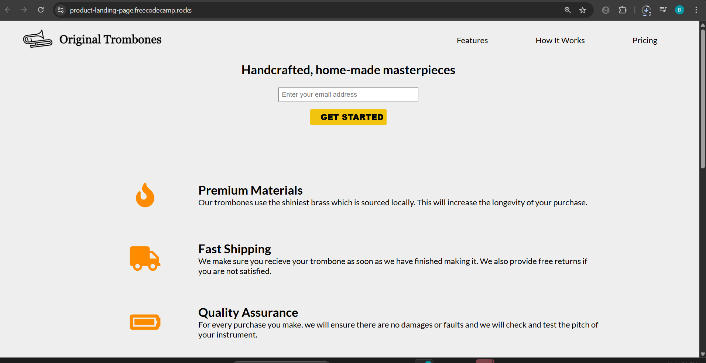

# 🎺 Product Landing Page Project

## 📖 About
A clean, modern, and fully responsive **Product Landing Page** built as part of the [freeCodeCamp Responsive Web Design Certification](https://www.freecodecamp.org/).  
This project gave me valuable hands-on experience with semantic HTML5, modern CSS layout systems, flexbox, media queries, and creating accessible, user-friendly marketing pages.

## 🎨 Features
- 📱 **Fully responsive design** with a mobile-first approach  
- ✨ **Clean, semantic HTML structure** for readability and SEO  
- 🎛️ Custom navigation bar with smooth section linking  
- 🎥 Embedded YouTube video integration  
- 🛒 Product pricing section with interactive selection buttons  
- 🔥 Accessible form for email collection  
- 🎨 Custom styled elements using modern CSS  
- ⚡ Fixed header for easy navigation  

## 🛠️ Technologies Used
- **HTML5**
- **CSS3 (Flexbox & Media Queries)**
- **FontAwesome** for icons  
- **Responsive Web Design Principles**

## 📸 Screenshot  

## 🌐 Live Demo  
👉 [View it Live on GitHub Pages](https://al-azaki.github.io/Product-Landing/)

## 💡 What I Learned
While building this project, I significantly improved my skills in:
- Structuring clean, maintainable, and semantic HTML  
- Creating fully responsive layouts using **flexbox and media queries**  
- Embedding and styling YouTube videos inside a webpage  
- Designing a modern, fixed header navigation bar  
- Building interactive product pricing cards with hover effects  
- Managing layout and typography for small and large screens  

## 📈 Next Steps
- [ ] Add active navigation highlight when scrolling  
- [ ] Implement form validation alerts  
- [ ] Polish mobile UX spacing and touch targets  
- [ ] Explore adding animations using CSS transitions  

## ✨ Author
**Bashir Al-Azaki**  
[LinkedIn](https://ye.linkedin.com/in/bashir-al-azaki-423453356) | [GitHub](https://github.com/AL-Azaki)

---

## 📌 Note for Reviewers & Fellow Developers:
This project was part of my continuous web development learning journey and every line of code was **written by me** following freeCodeCamp’s guidelines and best practices.  
I value feedback and suggestions — feel free to reach out or open an issue if you see room for improvement or want to collaborate on enhancements. 💪✨

---

 **Crafted by Bashir Al-Azaki**
